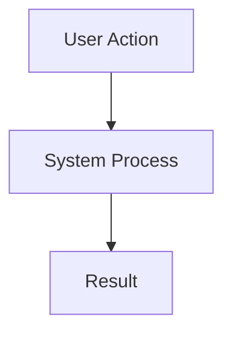

# Feature Name
> **Status**: [Draft/In Progress/Completed]
> **Related PR/Commit**: [Link]

## Overview
Briefly describe the new feature.

## Function Logic Map
<!-- requirement: Quote ALL node labels to prevent rendering errors with special chars -->

## Implementation Details
### Core Components
*   **[Function Name](../../path/to/file.ext#L100)**: Description of its role in the new feature.
*   **[NewComponent](../../path/to/file.ext#L50)**: UI/Logic implementation.

### Configuration
*   See example config: [config_name](../cfg_samples/example.json)

## Test Coverage
*   [TestFile](../src/tests/test_feature.rs)
