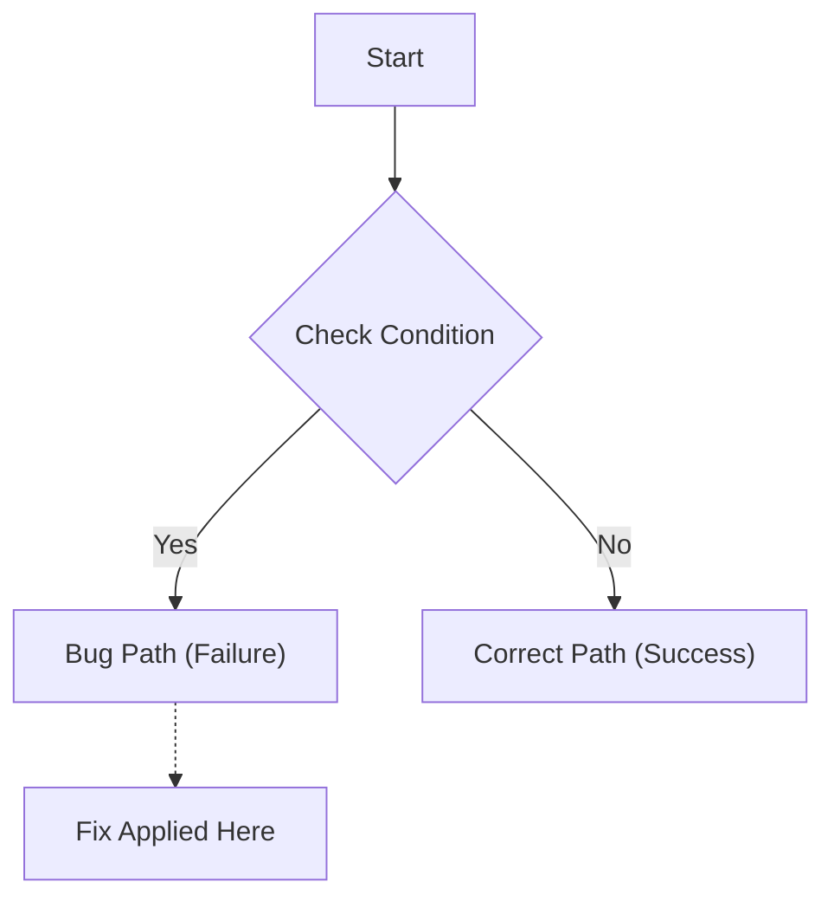

# Issue: [Brief Title]
> **Date**: YYYY-MM-DD
> **Severity**: [High/Medium/Low]

## Root Cause (Why)
Explain the specific logic failure. 

## The Fix (How)
Describe the solution implemented.

## Modified Files
*   **[Function Name](../../path/to/file.ext#L100)**: Brief description of the change.
*   **[AnotherFunction](../../path/to/file.ext#L200-L220)**: Fixing specific logic.

## Issue Logic Map
<!-- requirement: Quote ALL node labels to prevent rendering errors with special chars -->


## Verification
*   Commands run to verify fix:
    ```bash
    npm test specific_test
    ```
